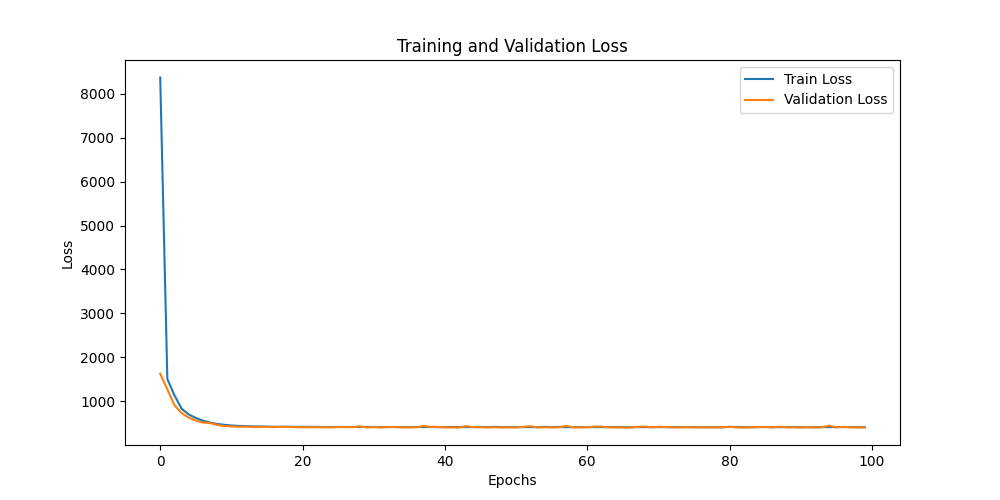
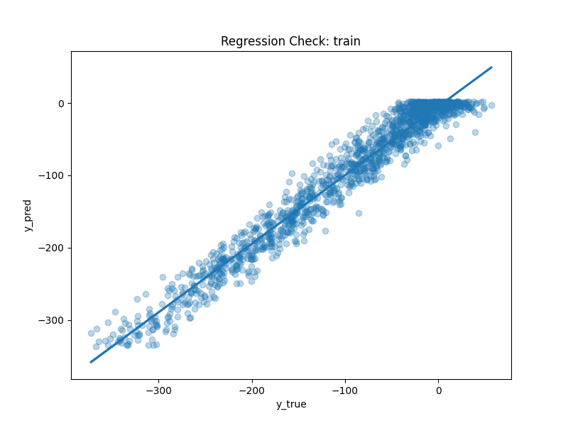
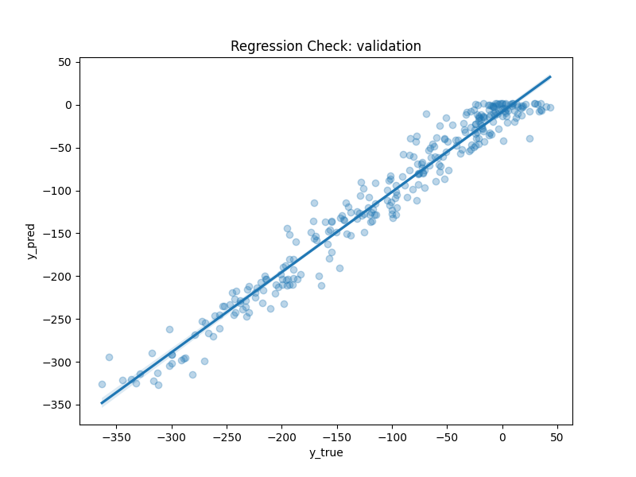
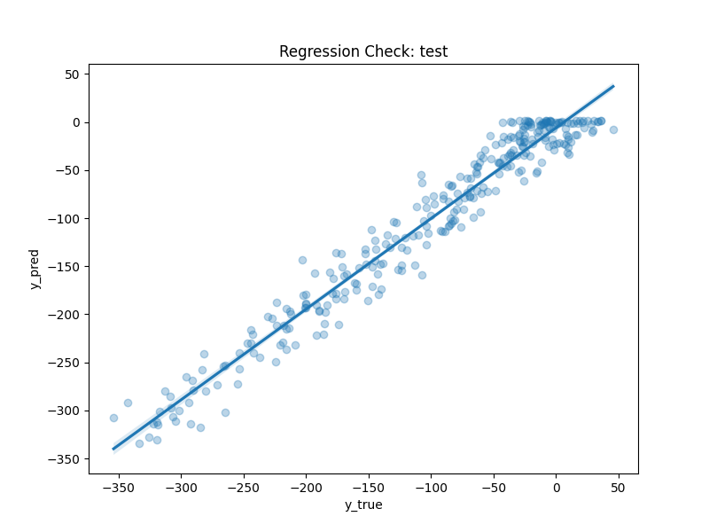
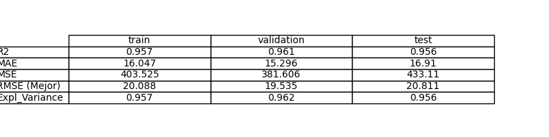
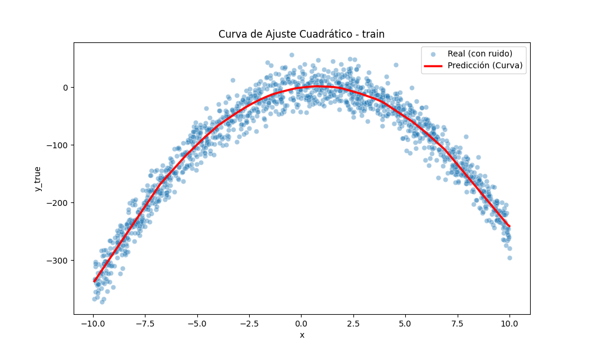
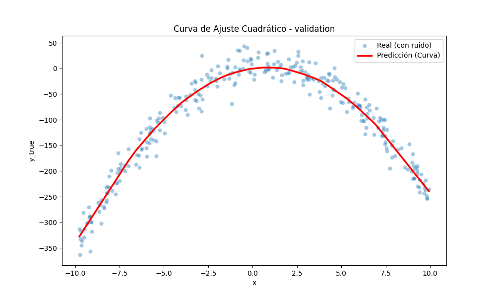
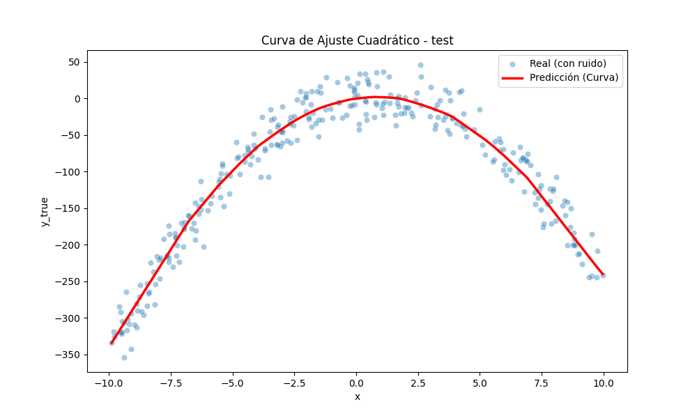

# Exercise 2: Learn a Quadratic function with PyTorch

## Objective

El objetivo principal es entrenar un modelo de aprendizaje automático (una red neuronal densa o MLP) capaz de aproximar una función no lineal subyacente (en este caso, una parábola $y = -3x^2 + 5x$) a partir de datos ruidosos. Se busca demostrar la capacidad de las redes neuronales para actuar como aproximadores universales de funciones.

## Task Formalization

El problema se define como una **regresión supervisada**. Dado un conjunto de pares $(x,y)$, donde $x$ es la variable independiente e $y$ es el valor observado (con ruido), queremos encontrar una función paramétrica $f(x;θ)$ que minimice la diferencia entre sus predicciones y los valores reales.

### Task Formalization (Inference)

En la etapa de inferencia, el modelo recibe un valor escalar $x∈\mathbb{R}$ (o un lote de valores) y, mediante una serie de transformaciones lineales y activaciones no lineales, produce una estimación **$\^y ∈ \mathbb{R}$**.

### Task Formalization (Training)

El entrenamiento consiste en ajustar los pesos $θ$ del modelo para minimizar una función de pérdida (Loss Function). Se utiliza el algoritmo de optimización **AdamW** para actualizar los pesos mediante la propagación hacia atrás (backpropagation) del error:

$$
\theta^* = \arg \min_{\theta} \sum_{i=1}^{N} \mathcal{L}(f(x_i; \theta), y_i)
$$

## Evaluation metrics

Para medir el desempeño del modelo, se han seleccionado las siguientes métricas:

1. **MSE (Mean Squared Error):** Mide el promedio de los errores al cuadrado. Penaliza fuertemente los valores atípicos.
2. **RMSE (Root Mean Squared Error):** Es la raíz cuadrada del MSE. **A diferencia del MSE, el RMSE está en las** **mismas unidades que la variable** $y$. Si $y$ representa metros, el RMSE te dice cuántos metros te equivocas en promedio. El $R^2$ es adimensional y a veces oculta que el error absoluto es inaceptable.
3. **MAE (Mean Absolute Error):** Promedio del valor absoluto de los errores, más robusto ante ruidos extremos y valores atípicos (outliers).
4. **R² (Coefficient of Determination):** Indica qué proporción de la varianza de los datos es explicada por el modelo (1.0 es un ajuste perfecto).
5. **Explained Variance Score:** Mide cuánto de la dispersión de los datos captura el modelo. Es similar al **$R^2$**, pero no penaliza el "sesgo" (bias). Se centra puramente en qué tan bien el modelo sigue la forma de la curva, independientemente de si la curva está desplazada hacia arriba o hacia abajo.

## Data Considerations

### Dataset description

El dataset es sintético y consiste en:

* **Función base:** $y = -3x^2 + 5x$
* **Rango de X:** Uniforme entre -10 y 10.
* **Ruido:** Ruido gaussiano (Normal) con $σ=20$.
* **Tamaño:** 10.000 muestras para el entrenamiento y 550 para la visualización inicial.

### Data preparation and preprocessing

1. **Generación:** Se crean los datos usando *numpy* y se convierten a *pandas.DataFrame* para visualización.
2. **Conversión:** Los datos se transforman a tensores de PyTorch (*torch.float32*).
3. **Reshaping:** Se asegura que las dimensiones sean (N, 1) para que sean compatibles con las capas lineales de PyTorch.
4. **Split:** Se divide el dataset en Train **(70%)**, Validation **(15%)** yTest **(15%)**.

   

### Data augmentation

No se aplica data augmentation ya que, la densidad de los datos es suficiente para que el modelo aprenda la forma de la función sin necesidad de transformaciones adicionales.

## Model Considerations

El modelo implementado en model.py es una Red Neuronal Densa, también conocida como Perceptrón Multicapa (MLP). A diferencia de un modelo de regresión lineal simple, esta arquitectura está diseñada para capturar relaciones complejas y no lineales entre las variables de entrada y salida.

El modelo `NonlinearRegressor` consta de una estructura de capas secuenciales:

1. **Capa de Entrada (Input Layer):** Recibe un tensor de dimensión `input_dim=1` (el valor de $x$).
2. **Primera Capa Oculta (Hidden Layer 1):** Una capa lineal (nn.Linear) que expande la entrada de 1 a 64 dimensiones (hidden_dim). Esta expansión permite al modelo proyectar el valor escalar $x$ en un espacio de características de mayor dimensión donde se pueden identificar patrones complejos.
3. **Primera Función de Activación:** Se aplica **ReLU (Rectified Linear Unit)**. Esta es la pieza clave para la no linealidad. ReLU transforma la salida permitiendo que el modelo "doble" la línea de regresión, creando una función lineal por partes.
4. **Segunda Capa Oculta (Hidden Layer 2):** Otra capa lineal de 64 a 64 dimensiones. La profundidad (añadir más de una capa oculta) permite al modelo aprender interacciones más sofisticadas entre las características extraídas en la primera capa.
5. **Segunda Función de Activación:** Una segunda capa ReLU para profundizar la capacidad de aproximación no lineal.
6. **Capa de Salida (Output Layer):** Una capa lineal que reduce las 64 dimensiones a `output_dim=1` (el valor predicho $\^y$).

### Justificación de los Componentes

* **Capacidad del Modelo (Hidden Dimensions):** Se han seleccionado 64 neuronas por capa. Esta decisión equilibra la capacidad expresiva (suficiente para dibujar la curva de una parábola con precisión) y el coste computacional (evitando un exceso de parámetros que podría llevar al sobreajuste o overfitting en datasets pequeños).
* **Uso de ReLU:** La función $f(z)=max(0,z)$ introduce puntos de quiebre en la función de activación. Al sumar muchas de estas funciones (64 por capa), el modelo es capaz de aproximar una curva suave como $y=−3x^2+5x$ mediante una combinación de múltiples segmentos lineales (aproximación *spline-like*).
* **Ausencia de Activación en la Última Capa:** La última capa es puramente lineal. Esto es fundamental en problemas de regresión, ya que el rango de la salida $y$ debe ser libre (en nuestro caso, la función cuadrática produce valores que pueden ser muy negativos). Si usáramos una activación como Sigmoide o Tangente Hiperbólica al final, limitaríamos artificialmente el rango de predicción a [0, 1] o [-1, 1].

### Suitable Loss Functions

Para problemas de regresión, las funciones más comunes son:

* **MSE (Mean Squared Error):** Estándar para regresiones.
* **MAE(Mean Absolute Error):** Útil si hay muchos outliers (valores atípicos).
* **Huber Loss:** Una combinación de ambas. Esta función es una función Loss robusta para regresión, que combina la mejores propiedades de MSE y MAE. Se comporta como MSE para errores pequeños (gradiantes suavizados) y como MAE para grandes errores (robusto ante outliers), haciendo uso de un parámetro umbral $δ$ para definir la frontera.

### Selected Loss Function

Se ha seleccionado **MSELoss (Mean Squared Error)**. Es la más adecuada para este caso porque el ruido añadido es gaussiano, y minimizar el MSE equivale a maximizar la fiabilidad bajo este tipo de ruido. Además de no presentar afectaciones fuertes de outliers como para implementar Huber Loss.

### Possible architectures

1. **Regresor Lineal Simple:** Insuficiente, ya que no puede capturar la curvatura de una parábola.
2. **MLP (Multi-Layer Perceptron):** Una red con al menos una capa oculta y funciones de activación no lineales (ReLU, Sigmoid).
3. **Regresión Polinómica:** Efectiva pero menos flexible que una red neuronal para funciones más complejas.

### Last layer activation

**Activación Lineal:** Para problemas de regresión donde el output puede ser cualquier valor real (como aplica en este caso), la última capa puede ser una de activación lineal para no restringir el rango de salida.

### Other Considerations

Se utiliza la activación **ReLU** en las capas ocultas para introducir la no-linealidad necesaria para aproximar el término cuadrático $x^2$. El modelo tiene 64 neuronas por capa, lo que otorga suficiente capacidad expresiva.

## Training

### Training hyperparameters

* **Optimizador:** AdamW
* **Tasa de aprendizaje:** 0.001
* **Batch Size:** 32
* **Epocas:** 100
* **Hidden Dimensions:** 64 (2 capas ocultas)
* **Early Saving:** Se guarda el modelo con la mejor pérdida de validación(*best_model_2.pth*)**.**

### Loss function graph

### Discussion of the training process

El proceso muestra una convergencia rápida. Al ser una función cuadrática simple, el modelo aprende la curvatura básica en las primeras épocas. El uso de un set de validación permite asegurar que el modelo no esté simplemente memorizando el ruido (overfitting), sino aprendiendo la tendencia central de la parábola.

## Evaluation

### Evaluation metrics

Las Métricas para cada dataset se muestran en la siguiente Tabla:

### Evaluation results

En esta sección se presentan ejemplos de los resultados para los sets de entrenamiento, validación y prueba.

Ejemplo para set de entrenamiento:

Ejemplo para set de validación:

Ejemplo para set de prueba:

### Discussion of the results

**¿Cómo el modelo resuelve el problema?** El modelo utiliza las funciones ReLU para crear una aproximación lineal por partes de la curva cuadrática. Con suficientes neuronas, estas partes se suavizan hasta ajustarse casi perfectamente a la parábola.
**¿Hay overfitting, underfitting o algún otro defecto?** Si el error de entrenamiento y validación son similares y bajos, no hay overfitting. Dado el gran tamaño del dataset (10,000 puntos) y la baja complejidad del modelo, el riesgo de overfitting es bajo.
**¿Cómo podemos mejorar el modelo?**  Se podría normalizar la entrada$x$(escalar a [0,1] o media 0, std 1) para acelerar la convergencia en caso de evaluar rangos mucho más extensos a los usados en el ejercicio.
**¿How this model will generalize to new data?**  El modelo generalizará bien dentro del rango $[−10,10]$. Sin embargo, si se hacen cambios del rango como $x=100$ o superiores, la predicción probablemente sea errónea.

## Design Feedback loops

* **Iteración 1:** Uso de un modelo lineal (Fracaso, R² muy bajo).
* **Iteración 2:** Introducción de capas ocultas con ReLU. El modelo empieza a generar una mejor aproximación al poder realizar curvamiento.
* **Iteración 3:** Aumento de neuronas de 16 a 64 para capturar mejor la forma suave de la función y ajuste de AdamW para una mejor regularización de pesos.

## Questions

Pleaser answer the following questions. Include graphs if necessary. Store the graphs in the `outs/exercise_02` folder.

### ¿Cuales son las diferencias que haz hayado entre el modelo anterior y este modelo?

La diferencia principal es la capacidad de **ajuste no lineal**. El modelo lineal solo podía dibujar una línea recta (intentando pasar por la media de los puntos), mientras que este modelo, gracias a las capas ocultas y las funciones de activación ReLU, puede modelar la curvatura negativa de la parábola $x^2$. Visualmente, esto se nota en que la línea de predicción en el gráfico de dispersión sigue la forma de "U" invertida.

### ¿El modelo generaliza bien para nuevos datos?

Dentro del dominio de entrenamiento ($x∈[−10,10]$), el modelo generaliza excelente, como se ve en el set de Test donde las métricas son consistentes con las de training. Sin embargo, no generalizará bien fuera de ese rango (extrapolación). Como las ReLU se vuelven lineales en los extremos, el modelo predecirá una línea recta infinita hacia afuera en lugar de seguir cayendo cuadráticamente.
