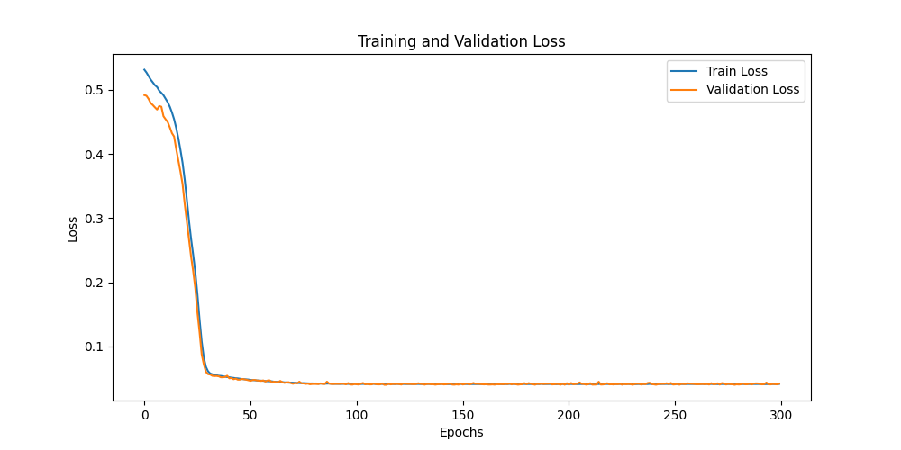
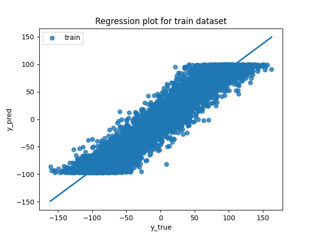
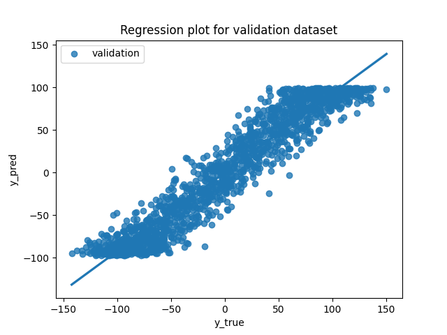
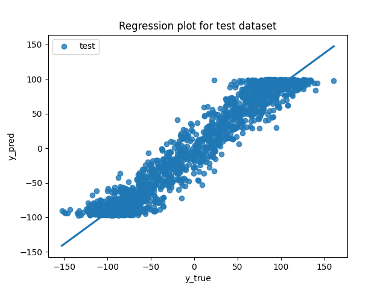
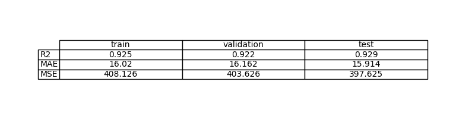
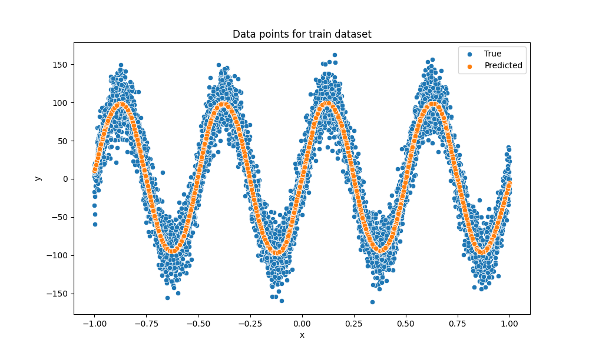
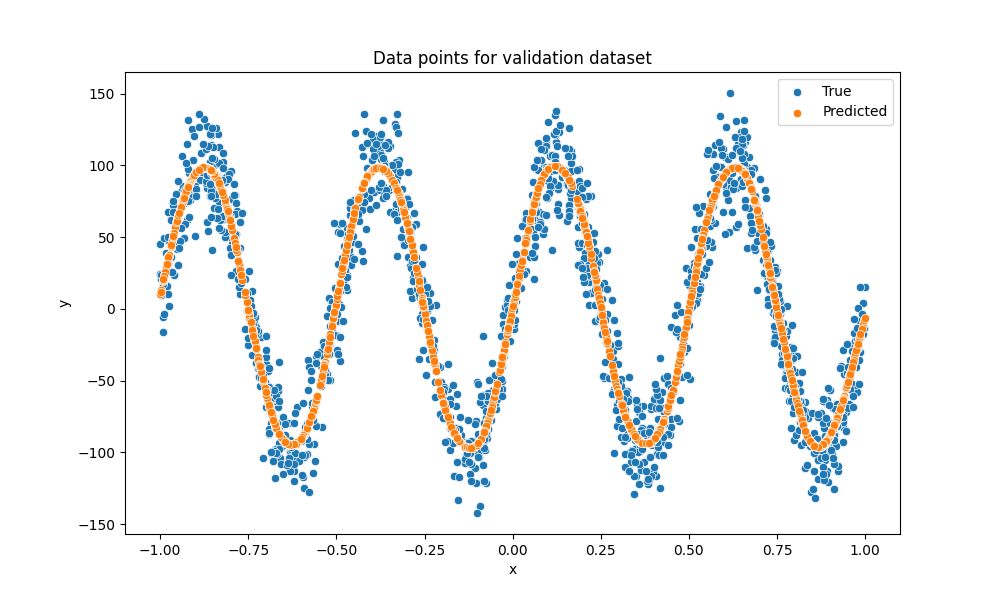
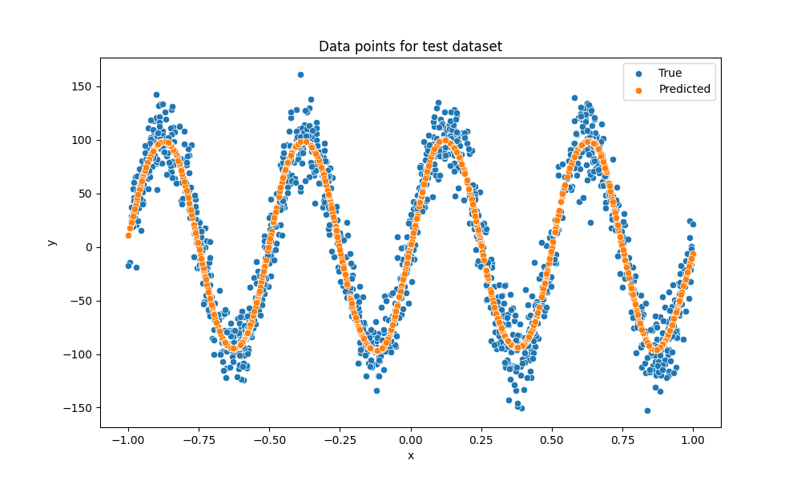

# Exercise 3: Learn a sinusoial  function with PyTorch

## Objective

El objetivo es aproximar una función desconocida a partir de muestras ruidosas mediante un modelo de aprendizaje automático (red neuronal) entrenado con PyTorch. En este ejercicio, la función subyacente es una senoide con ruido añadido

## Task Formalization

Se trata de un problema de regresión supervisada: a partir de una entrada escalar 𝑥, se desea predecir una salida escalar y.

### Task Formalization (Inference)

Entrada: un valor real x (1 dimensión).
Salida: una predicción y^ (1 dimensión).
Durante inferencia, dado un x nuevo, el modelo calcula y^ =𝑓(𝑥) con los pesos aprendidos.

### Task Formalization (Training)

Durante el entrenamiento, el modelo recibe pares de datos (x,y) y ajusta sus parámetros minimizando una función de pérdida que mide la diferencia entre las predicciones y los valores reales. El objetivo es encontrar los parámetros que mejor aproximen la función senoidal subyacente en presencia de ruido.

## Evaluation metrics

Para evaluar el rendimiento del modelo se utilizan métricas estándar de regresión:

    - MSE (Mean Squared Error): mide el error cuadrático medio y penaliza errores grandes.

    - MAE (Mean Absolute Error): mide el error absoluto medio.

    - R2 (coeficiente de determinación): indica qué proporción de la varianza de los datos es explicada por el modelo.

## Data Considerations

### Dataset description

El dataset es sintético y se genera a partir de la siguiente expresión:

            y = 100 · sin(8πx / 100) + 2 + ruido

donde x se muestrea uniformemente en el intervalo [0, 100] y el ruido es gaussiano. Esto simula un escenario realista con observaciones imperfecta

### Data preparation and preprocessing

El dataset se divide en tres subconjuntos:

    - 70% para entrenamiento

    - 15% para validación

    - 15% para test

Antes del entrenamiento, los datos fueron preprocesados para mejorar la estabilidad del aprendizaje.
La variable de entrada x fue normalizada a un rango aproximado [−1,1]. Además, la variable objetivo 𝑦
fue escalada dividiendo por una constante para reducir su amplitud y evitar problemas de saturación en las funciones de activación.

Este preprocesamiento permitió que el modelo entrenara de forma más estable y facilitó la aproximación de la función senoidal en todo el rango de entrada.

### Data augmentation

No se aplicaron técnicas de data augmentation, ya que el dataset es sintético y ya incorpora ruido de forma explícita.

## Model Considerations

Dado que la función objetivo es no lineal (senoidal), un modelo lineal no es suficiente para resolver el problema adecuadamente.

### Suitable Loss Functions

Las funciones de pérdida adecuadas para este problema de regresión incluyen:

    - Mean Squared Error (MSE)

    - Mean Absolute Error (MAE)

    - Huber Loss

### Selected Loss Function

Se seleccionó Mean Squared Error (MSE) por ser una función estándar en problemas de regresión y por penalizar de forma 
más severa los errores grandes.

### Possible architectures

Se evaluaron distintas arquitecturas:

    - Perceptrón simple (modelo lineal), que no logra capturar la senoide. (SimplePerceptron)

    - MLP con una capa oculta, que mejora el ajuste pero puede quedarse corto en algunas regiones. (MultiLayerPerceptron)

    - MLP con dos capas ocultas, que ofrece mayor capacidad para aproximar funciones oscilatorias complejas. (DoubleMultiLayerPerceptron)

### Last layer activation

La última capa del modelo utiliza una activación lineal (sin función de activación), lo cual es adecuado para problemas de regresión, ya que permite predecir valores reales sin restricciones.

### Other Considerations

Se utilizó la función de activación tanh en las capas ocultas, ya que es suave, continua y adecuada para representar funciones onduladas como la senoide.

## Training

El modelo se entrenó utilizando validación en cada época y guardando los mejores pesos según la pérdida de validación.

### Training hyperparameters

Configuración final utilizada:

    - Arquitectura: MLP con doble capa oculta

    - Neuronas ocultas: 64

    - Activación: tanh

    - Optimizador: AdamW

    - Learning rate: 0.0003

    - Número de épocas: 300

    - Batch size: 10

    - Función de pérdida: MSE

### Loss function graph

### Discussion of the training process

Durante el entrenamiento, la pérdida de entrenamiento y validación decrecen de forma progresiva y estable. No se observa un sobreajuste significativo, ya que ambas curvas se mantienen cercanas. El uso de dos capas ocultas permite al modelo capturar mejor la estructura no lineal de la senoide.

## Evaluation

### Evaluation metrics

Las métricas de evaluación (R2, MAE y MSE) se calculan para los conjuntos de entrenamiento, validación y test, permitiendo evaluar tanto el ajuste como la capacidad de generalización del modelo.

Metrics for each dataset is depicted: 

### Evaluation results

Here you have examples of evaluation results for train, validation and test sets.

Example for train set:

Example for validation set:

Example for test set:

### Discussion of the results

El modelo aprende una aproximación suavizada de la función senoidal, capturando correctamente su periodicidad principal y su tendencia global, aunque no reproduce exactamente todos los puntos debido al ruido presente en los datos.

No se observa un overfitting fuerte, ya que el rendimiento en validación y test es comparable al de entrenamiento. En algunas regiones puede existir un ligero underfitting local, donde la predicción se suaviza.

El modelo generaliza razonablemente bien a nuevos datos siempre que estos sigan la misma distribución (senoide con ruido).

## Design Feedback loops

El proceso de mejora del modelo fue iterativo:

Se comenzó con un modelo lineal, que mostró un claro subajuste.

Se introdujo un MLP con activaciones no lineales y se cambio la función de ativación de Relu a Tanh.

Se aumentó la capacidad del modelo añadiendo una segunda capa oculta.

Se ajustaron hiperparámetros como el learning rate y el número de épocas hasta obtener un compromiso adecuado entre estabilidad y rendimiento.

Se normalizo el Dataset con el fin de mejorar la estabilidad del aprendizaje

## Questions

Pleaser answer the following questions. Include graphs if necessary. Store the graphs in the `outs/exercise_03` folder.

### Which are the differences you found between previous model and this one?

En comparación con el modelo anterior (perceptrón simple o MLP de una sola capa), el modelo final introduce mayor no linealidad mediante activaciones tanh, tiene mayor capacidad representacional gracias a dos capas ocultas, logra capturar mejor la estructura periódica de la función seno y reduce el subajuste observado en modelos más simples.

### Does the model generalizes well to new data?

Sí, el modelo generaliza adecuadamente a nuevos datos generados a partir de la misma distribución. Esto se evidencia en el comportamiento similar de las métricas en entrenamiento, validación y test, y en la capacidad del modelo para capturar la tendencia global de la senoide.

