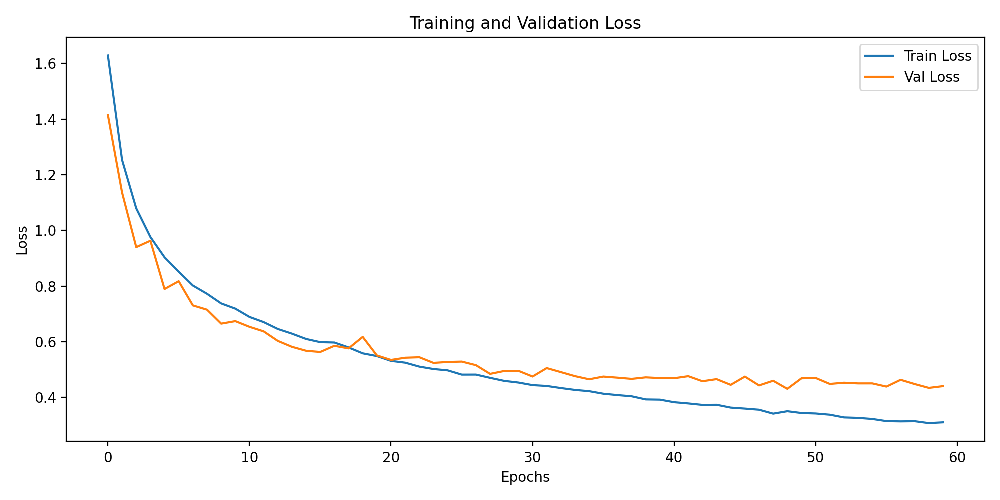
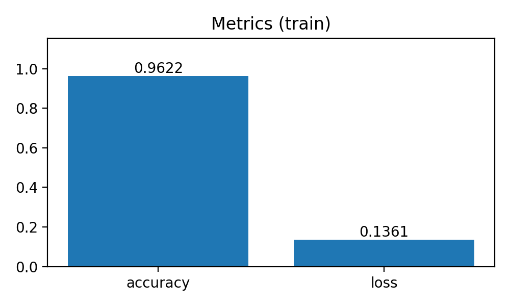
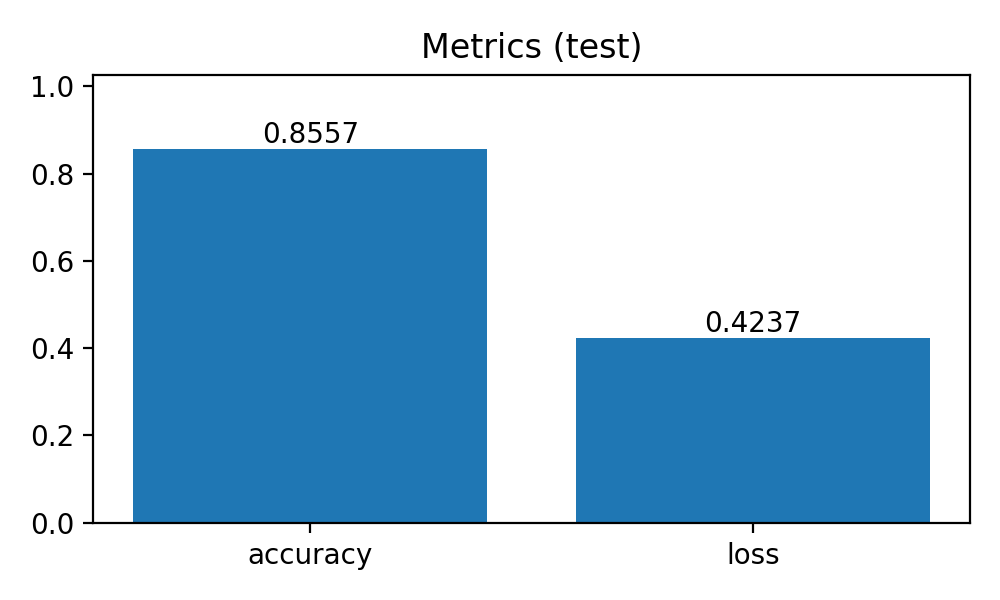
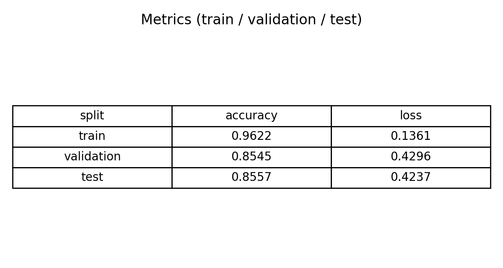
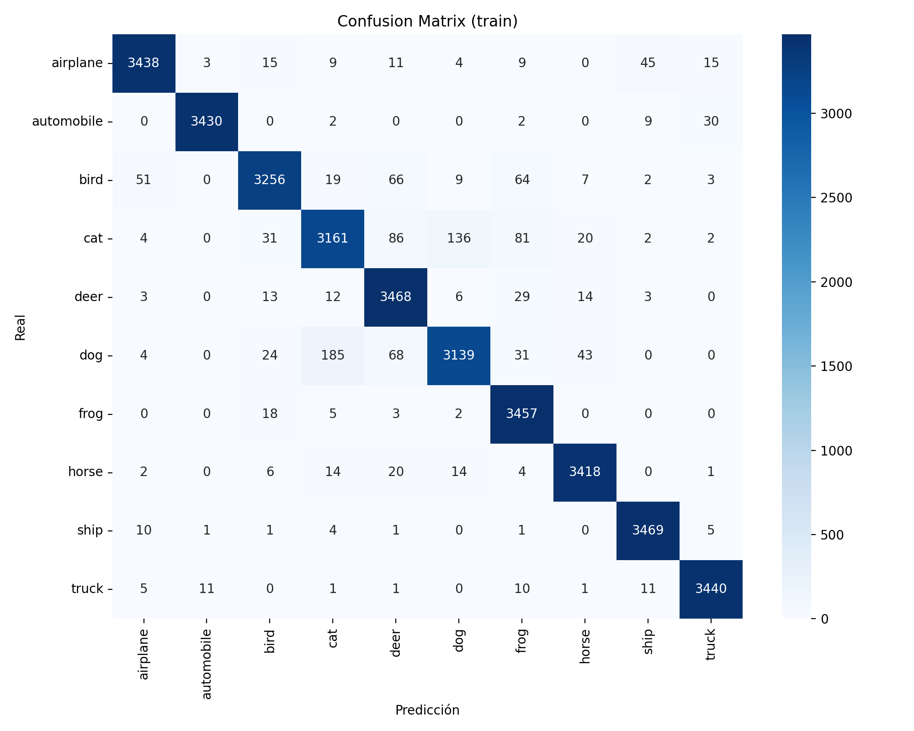
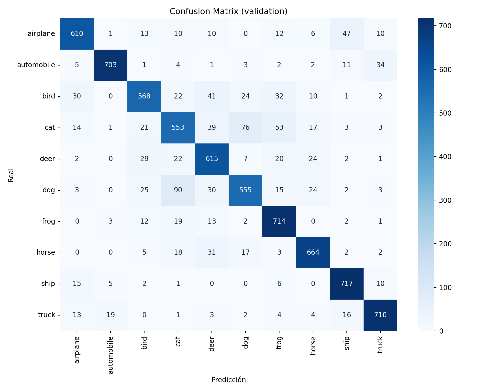
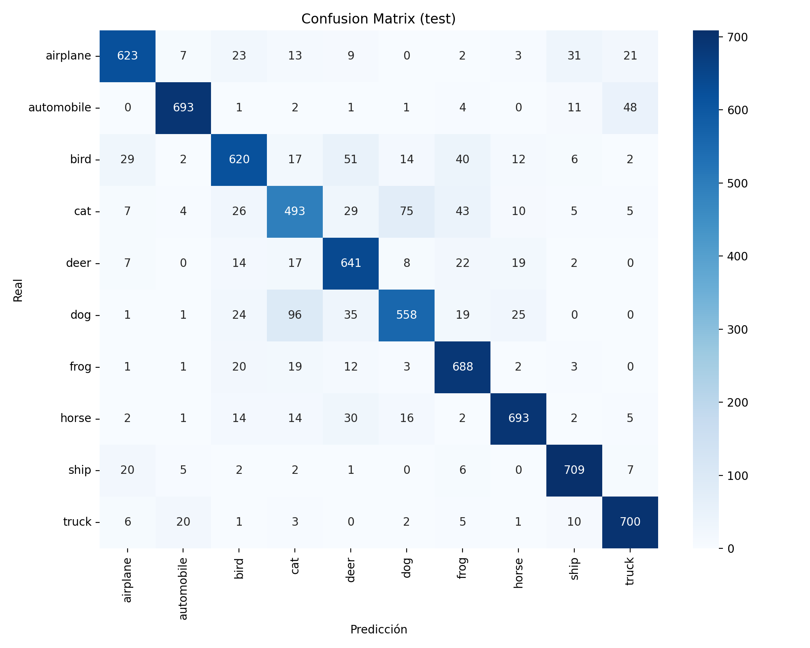

# Exercise 1: Create a Deep Learning Model for image classification in PyTorch with CIFAR-10 dataset

## Objective

Develop a model that can classify images from CIFAR-10 dataset

Then try a model with convolutional layers
Create an evaluate.py file that evaluates the model and calculates and stores the evaluation metrics including a confusion matrix

Compare this method with previous one (previous exercise)
Whats the effect of data augmentation?

Compare both methods and discuss the differences

## Task Formalization

El problema consiste en clasificar imágenes del dataset CIFAR-10 en una de sus diez categorías. Cada imagen tiene tamaño 32×32 píxeles y tres canales de color (RGB). El modelo recibe la imagen preprocesada y produce diez valores numéricos, cada uno asociado a una clase. La clase predicha corresponde al valor máximo. Se trata de un problema de clasificación multiclase supervisada, donde el modelo aprende a partir de ejemplos etiquetados.

### Task Formalization (Inference)

Durante inferencia, la imagen se normaliza, se introduce en la red neuronal y se obtienen los logits de salida. La predicción final se obtiene seleccionando la clase con mayor valor (argmax). No se aplica softmax explícito, ya que no es necesario para la predicción.

### Task Formalization (Training)

Durante el entrenamiento, el modelo ajusta sus parámetros mediante la función de pérdida de entropía cruzada entre los logits predichos y las etiquetas reales. Se utiliza optimización basada en gradiente mediante AdamW, lo que permite una convergencia estable y regularizada.

## Evaluation metrics

Para evaluar el rendimiento del modelo se utilizan:

    - Accuracy: proporción de predicciones correctas.

    - Loss promedio: mide el error medio del modelo.

    - Matriz de confusión: permite analizar errores por clase.

Estas métricas se calculan para los conjuntos de entrenamiento, validación y prueba.

## Data Considerations

### Dataset description

CIFAR-10 es un dataset estándar de clasificación de imágenes compuesto por 60 000 imágenes RGB de 32×32 píxeles distribuidas en 10 clases (aviones, automóviles, aves, gatos, ciervos, perros, ranas, caballos, barcos y camiones).
En este caso, el conjunto de entrenamiento se divide internamente en:

    - 70% entrenamiento

    - 15% validación

    - 15% prueba

### Data preparation and preprocessing

Las imágenes se transforman mediante conversión a tensor (ToTensor) y normalización usando medias y desviaciones estándar de CIFAR-10. La normalización mejora la estabilidad del entrenamiento y acelera la convergencia.

### Data augmentation

No se aplica aumento de datos en la configuración actual.

## Model Considerations

El modelo utilizado es una red neuronal convolucional (CNN). Las CNN son adecuadas para imágenes porque explotan la estructura espacial mediante filtros convolucionales que detectan patrones locales. La arquitectura incluye:

    - Capas convolucionales para extracción de características

    - Batch Normalization para estabilizar el entrenamiento

    - MaxPooling para reducir dimensionalidad 

    - Dropout para regularización

    - Capas totalmente conectadas para la clasificación final.

### Suitable Loss Functions

Para clasificación multiclase con una única etiqueta por imagen, la función de pérdida más adecuada es CrossEntropyLoss.

### Selected Loss Function

Se utiliza CrossEntropyLoss, ya que combina log-softmax y entropía cruzada en una sola operación y funciona directamente con logits.

### Possible architectures

Algunas arquitecturas posibles para este problema incluyen:

    - Perceptrón multicapa (MLP)

    - Redes convolucionales simples

    - CNN profundas

    - Arquitecturas modernas como ResNet

La CNN utilizada ofrece un equilibrio entre complejidad y rendimiento.

### Last layer activation

La última capa es lineal y produce logits. No se aplica softmax porque la función CrossEntropyLoss lo incorpora internamente.

### Other Considerations

Batch normalization acelera el entrenamiento y mejora la estabilidad, además de eso, dropout actúa como regularizador reduciendo el riesgo de sobreajuste.

## Training

El modelo se entrena durante múltiples épocas utilizando mini-batch gradient descent. Se guarda el modelo con mejor rendimiento en validación para asegurar una mejor generalización.

### Training hyperparameters

Los parametros utilizados en el entrenamiento han sido:

    - Optimizador: AdamW

    - Learning rate: 3e-4

    - Weight decay: 1e-4

    - Batch size: 64

    - Epochs: 60

### Loss function graph

### Discussion of the training process

Se puede apreciar como durante las primeras épocas, tanto la perdida de validación como la de entrenamiento bajan rapidamente, sin embargo, a partir de la epoca 30, la validación comienza a estabilizarse mientras que la de entrenamiento sigue disminuyendo, auemntando la diferencia entre esas dos funicones. 
Eso indica un leve sobreajuste en el proceso, debido a que el modelo es muy potente y se ha utilizado un numero de épocas elevado, no obstante, tampoco supone un comportamiento preocupante ya que es normal en modelos de redes neuronales convolucionales. Lo optimo, sería entrenar entre 30 y 40 épocas.
## Evaluation

### Evaluation metrics

Las métricas muestran el rendimiento del modelo en los conjuntos de entrenamiento, validación y prueba, incluyendo precisión, pérdida y matrices de confusión.

Metrics for each dataset is depicted: 

### Evaluation results

Here you have examples of evaluation results for train, validation and test sets.

Example for train set:

Example for validation set:

Example for test set:

### Discussion of the results

El modelo alcanza:

    - Accuracy entrenamiento: 96.22%

    - Accuracy validación: 85.45%

    - Accuracy test: 85.57%

Hay una diferencia del 10% en la precisión entre el entrenamiento y la validación, lo cual indica la presencia de sobreajuste moderado, esto mismo, ya se habia mencionado en la grafica de las funciones de perdida de validación y entrenamiento, lo cual es habitual en redes convolucionales profundas. Sin embargo, la similitud entre validación y test confirma que el modelo generaliza correctamente a datos no vistos.

Por otro lado, La matriz de confusión muestra un predominio claro de valores en la diagonal principal, lo que indica un alto número de clasificaciones correctas.

## Design Feedback loops

El proceso de mejora del modelo consiste en:

    1º: Entrenar el modelo base

    2º: Evaluar métricas y matrices de confusión

    3º: Identificar errores frecuentes

    4º: Ajustar hiperparámetros o arquitectura

    5º: Reentrenar y comparar resultados

## Questions

Pleaser answer the following questions. Include graphs if necessary. Store the graphs in the `outs/exercise_04` folder.

### Which are the differences you found between previous model and this one?

El modelo convolucional supera al modelo de la fully connected basado en capas densas porque aprovecha la estructura espacial de las imágenes. Las CNN detectan patrones locales y jerárquicos, mientras que los modelos densos tratan los píxeles como características independientes.

Como resultado, el modelo actual presenta mayor precisión, errores más coherentes (principalmente entre clases similares) y mejor capacidad de generalización.

### Does the model generalizes well to new data?

Si las métricas de validación y prueba son similares y no difieren significativamente del entrenamiento, el modelo muestra una buena capacidad de generalización. Sin embargo, dado que el conjunto de prueba proviene del mismo conjunto original, una evaluación con el test oficial del dataset proporcionaría una estimación más realista del rendimiento en datos completamente nuevos.

La generalización puede mejorarse mediante data augmentation, regularización adicional y ajustes en la arquitectura.

