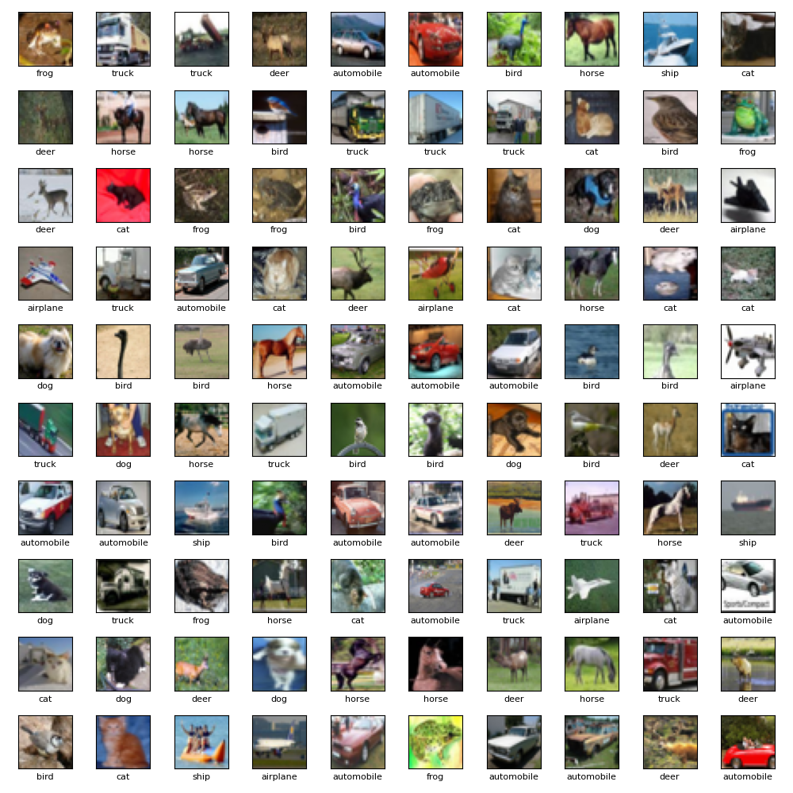
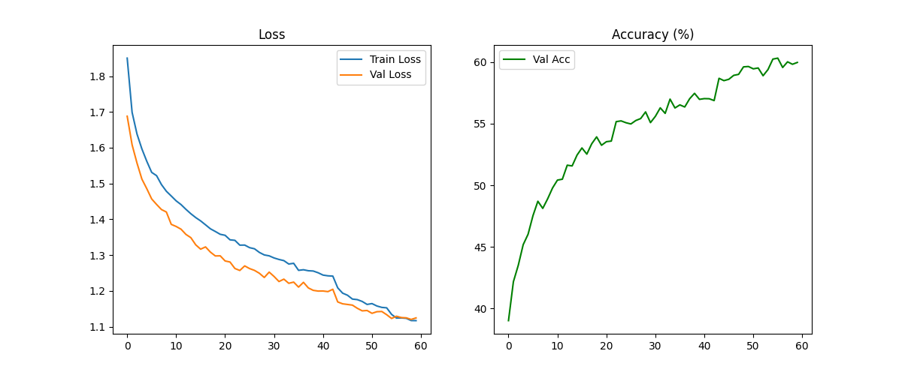
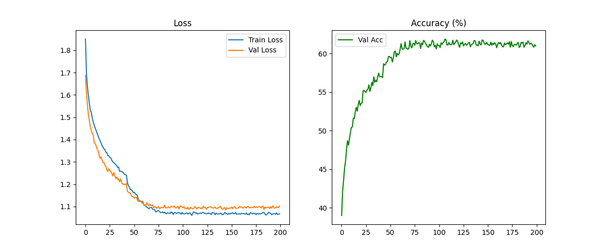
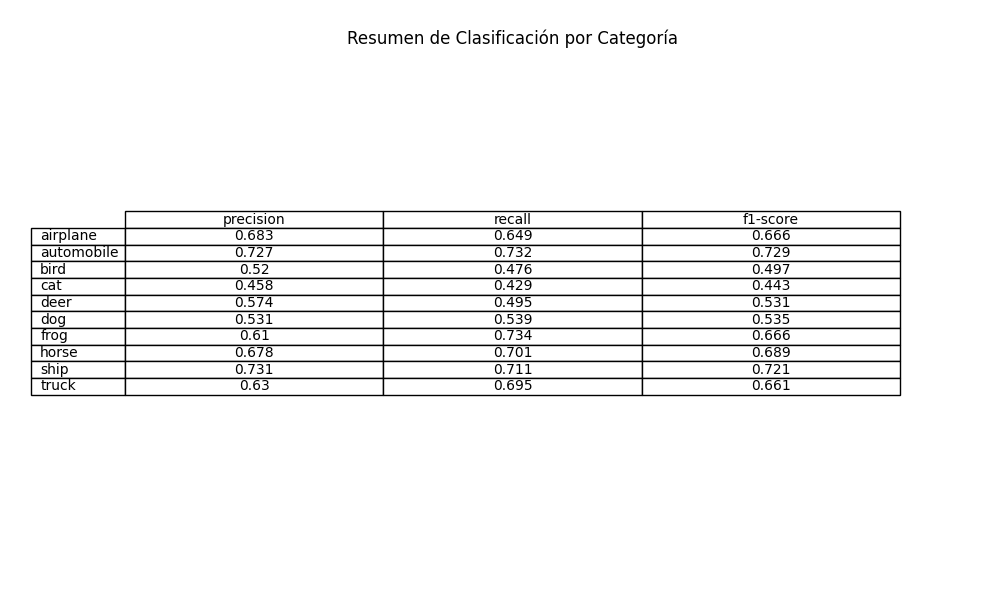
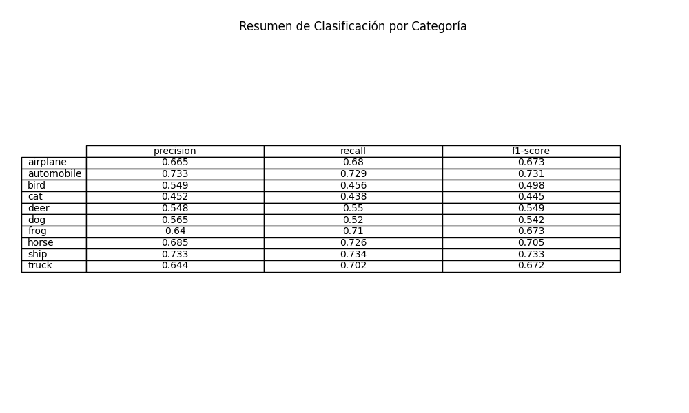
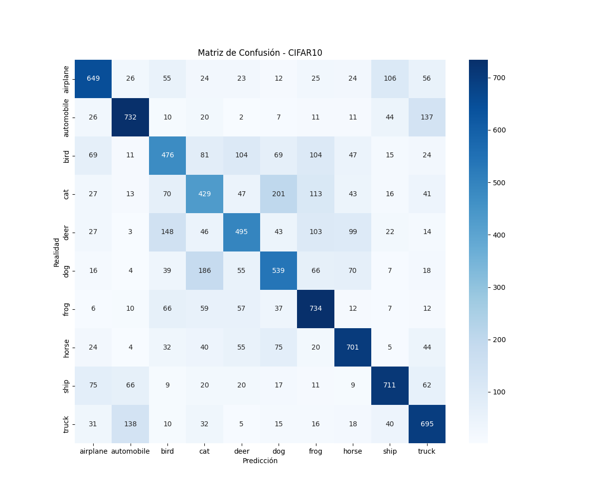
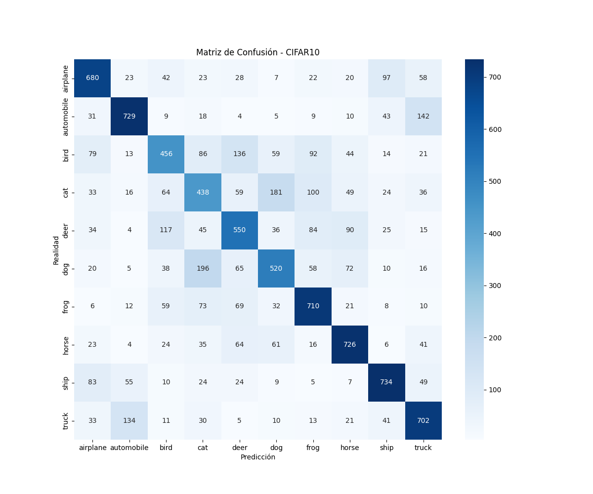

# Exercise 5: Create a Deep Learning Model for image classification in PyTorch with CIFAR-10 dataset and a Multi-Layer Neural Network

## Objetivo

El objetivo es desarrollar un modelo de aprendizaje profundo de red neuronal multicapa (MLP - Multi-Layer Perceptron) para la clasificación de imágenes utilizando el conjunto de datos CIFAR-10. El modelo debe entrenarse, validarse y, finalmente, evaluarse en un conjunto de pruebas retenido. La evaluación incluye el cálculo de métricas de clasificación estándar (precision, recall, F1‑score por clase, overall accuracy) y una matriz de confusión. El objetivo es comprender las capacidades y limitaciones de una red densa simple en un conjunto de datos de imágenes de complejidad moderada.

Which are the conclussions?

## Task Formalization

La tarea consiste en un problema de clasificación de imágenes de 10 clases. Dada una imagen de entrada de tamaño 32×32×3, el modelo debe predecir una de las diez categorías mutuamente excluyentes: avión, automóvil, pájaro, gato, ciervo, perro, rana, caballo, barco, camión.

### Task Formalization (Inference)

Para una nueva imagen, el modelo genera un vector de 10 clases y elige un índice con la clase más alta.

La inferencia consiste en un paso hacia adelante (feed-forward):

* **Input Flattening:** La imagen de 32x32x3 se "aplana" a un vector de 3072 dimensiones.
* **Capas Ocultas:** Tres capas densas con 1024, 512 y 256 neuronas respectivamente.
* **Activación y Normalización:** Se usa ReLU para introducir no linealidad y Batch Normalization para estabilizar las activaciones.
* **Salida:** Una capa lineal de 10 neuronas que devuelve puntuaciones brutas por clase.

### Task Formalization (Training)

El modelo está entrenado para minimizar la pérdida de entropía cruzada entre sus puntuaciones brutas de salida y las etiquetas de clase de referencia (proporcionadas como números enteros). El entrenamiento implica pasadas hacia adelante y hacia atrás, optimización mediante descenso de gradiente y técnicas de regularización (abandono, decaimiento de peso, normalización por lotes) para mejorar la generalización.

El entrenamiento es supervisado utilizando:

* **Función de Pérdida:** CrossEntropyLoss.
* **Optimizador:** AdamW con un Learning Rate inicial de 1e-3 y Weight Decay de 1e-2.
* **Regularización:** Dropout (30% y 20%) para evitar que las neuronas se vuelvan codependientes.
* **Optimización dinámica:** Uso de un ReduceLROnPlateau que reduce el LR a la mitad si la precisión de validación no mejora tras 3 épocas.

## Evaluation metrics

Las siguientes métricas se calculan en el conjunto de prueba (10 000 imágenes, 1000 por clase). Estas métricas se guardan como tablas CSV y se visualizan como mapas de calor y tablas.

* **Accuracy:** Porcentaje de predicciones correctas totales.
* **F1-Score:** Media armónica entre precisión y recall, vital para ver el equilibrio en clases difíciles (gatos, pájaros).
* **Matriz de Confusión:** Visualización de los errores específicos (ej. cuántos gatos se confunden con perros).

## Data Considerations

### Dataset description

CIFAR-10 consta de 60 000 imágenes en color de 32×32 pixeles, divididas en 50 000 imágenes de entrenamiento y 10 000 imágenes de prueba. Cada imagen pertenece a una de las diez clases. El conjunto de datos está equilibrado: cada clase tiene exactamente 5000 muestras de entrenamiento y 1000 muestras de prueba.

### Data preparation and preprocessing

* **Normalización:** Las imágenes se normalizan utilizando la media y la desviación estándar del conjunto de entrenamiento CIFAR-10 por canal: `media = (0,4914; 0,4822; 0,4465)`, `desviación estándar = (0,2023; 0,1994; 0,2010)`. Esto centra los datos y los escala a una varianza unitaria, lo que ayuda a la optimización al acelerar la convergencia.
* **División entre entrenamiento y validación:** el 80 % del conjunto de entrenamiento (40 000 imágenes) se utiliza para el entrenamiento, y el 20 % (10 000) para la validación. El conjunto de validación ayuda a controlar el overfitting y a seleccionar el mejor modelo.
* **Test set:** El CIFAR‑10 test set (10 000 images) original se utiliza unicamente para la etapa de evaluación final.

  A continuación se muestra una muestra visual del dataset (las primeras 100 imagenes del training set):

### Data augmentation

Para mejorar la generalización y aumentar artificialmente el tamaño del conjunto de entrenamiento, se aplican las siguientes ampliaciones solo al **training set**:

* **Random horizontal flip (con probabilidad 0.5)** – introduce invariancia en el reflejo.
* **RandomCrop(32, padding=4):** Recorte aleatorio que simula ligeras traslaciones para ayudar al modelo a enfocarse en el objeto completo aprendiendo a identificar objetos que no están perfectamente centrados.

No se aplica ningún aumento a las imágenes de validación o prueba; solo se someten a normalización y conversión tensorial.

## Model Considerations

### Suitable Loss Functions

Para problemas de clasificación multiclase con clases mutuamente excluyentes (como el que aplica para este caso), la función Loss estándar es la entropía cruzada (`CrossEntropyLoss`).

### Selected Loss Function

Para esta ocasión se hizo uso de `nn.CrossEntropyLoss()` de PyTorch. Espera logits sin procesar como entrada y aplica internamente softmax, luego calcula la pérdida. Esto es numéricamente estable y evita el softmax explícito en el modelo.

### Possible architectures

Se ha elegido una red Fully Connected (perceptrón multicapa). Esta red hace uso de una capa flatten al principio con la entrada de 3×32×32 en un vector de 3072 dimensiones y la pasa a través de 3 conjuntos de capas distribuidas con la siguiente disposición:

* nn.Linear(input_dim, hidden_dim)
* nn.BatchNorm1d(hidden_dim): se añade después de cada capa lineal oculta (antes de ReLU) para estabilizar el entrenamiento y acelerar la convergencia.
* nn.ReLU()
* nn.Dropout(0<n<1)

### Last layer activation

En la última capa se implementa una `nn.Linear (sin activación)`. Esto es porque `CrossEntropyLoss` espera los valores brutos (logits). Además de considerar que al hacer uso de la función `CrossEntropyLoss` en PyTorch, lleva de forma implicita al final la implementación de Softmax. Por esta razón, se debe implementar la capa lineal al final.

### Other Considerations

* **Regularización:** Se utilizan el dropout (0,3 después de la primera capa oculta, 0,2 después de la segunda) y el decaimiento del peso (penalización L2, `weight_decay=1e-2` en AdamW) para evitar el overfitting.
* **Architecture details** :

  * Input: 3072
  * Hidden1: 1024 → BatchNorm → ReLU → Dropout(0.3)
  * Hidden2: 512 → BatchNorm → ReLU → Dropout(0.2)
  * Hidden3: 256 → BatchNorm → ReLU
  * Output: 10 (logits)

## Training

### Training hyperparameters

* **Batch Size:** 64
* **Optimizer:** AdamW
* **Learning Rate:** 0.001 (inicial)
* **Weight decay:** 0.01
* **Scheduler:** ReduceLROnPlateau (mode='max', factor=0.5, patience=3)
* **Epochs:** 60 y 200 (comparativa)

### Loss function graph

A continuación se muestran las curvas de pérdida de entrenamiento/validación y precisión de validación para 60 y 200 épocas.

**60 epochs**

**200 epochs**

### Discussion of the training process

A 60 épocas, la pérdida desciende de forma constante pero no llega a estabilizarse. La precisión de la validación alcanza ~59 % en la época 60. No hay signos claros de sobreajuste grave.

Alrededor de la época 45-50 se observa un escalón brusco hacia abajo en la Loss (y un salto hacia arriba en el Accuracy), demostrando que el  `ReduceLROnPlateau` funciona al reducir la tasa de aprendizaje cuando el modelo se estanca.

A partir de la época 75-80, las curvas se vuelven completamente planas. El Accuracy de validación oscila en una franja muy estrecha entre el 61% y el 62.5%.

Algo a destacar es que la pérdida de validación (`Val Loss`) nunca se dispara por encima de la de entrenamiento (`Train Loss`). Las técnicas de regularización (Dropout, BatchNorm y Data Augmentation) fueron tan efectivas que impidieron el sobreajuste.

Al extender el entrenamiento a 200 épocas, observamos un comportamiento de saturación del modelo donde se puede evidenciar que El problema con este modelo comparado con uno CNN es con respecto al sesgo (underfitting relativo), la arquitectura Fully Connected no tiene la capacidad de aprender patrones más complejos.

## Evaluation

A la hora de evaluar un modelo de clasificación, la precisión por sí sola no suele ser suficiente, especialmente cuando las clases están desequilibradas o cuando el costo de los falsos positivos difiere del de los falsos negativos. Tres métricas complementarias (precisión, recuperación y puntuación F1) proporcionan una imagen más detallada del rendimiento del modelo.

Los tres se derivan de la matriz de confusión, que registra:

* **Verdaderos positivos (TP):** clase positiva predicha correctamente.
* **Falsos positivos (FP):** predichos incorrectamente como positivos.
* **Falsos negativos (FN):** casos positivos no detectados.
* **Verdaderos negativos (TN):** clase negativa predicha correctamente.

Para un problema multiclase como CIFAR-10, estas métricas se calculan por clase (considerando la clase de interés como «positiva» y todas las demás como «negativas») y, a continuación, se promedian.

### Evaluation metrics

**Precision:** de todos los casos que el modelo ha etiquetado como clase X, ¿cuántos pertenecen realmente a la clase X?

$$
Precision=\frac{TP}{TP+FP}
$$

* Una alta precisión significa que el modelo es confiable cuando predice esa clase, con pocas falsas alarmas.
* Una baja precisión indica que el modelo suele predecir esa clase de forma incorrecta.
* Como ejemplo, Para clase Automovil, una precisión = 0,943 significa que cuando el modelo dice «esto es un automóvil», es correcto el 94,3 % de las veces.

**Recall:** De todos los casos reales de clase X, ¿cuántos identificó correctamente el modelo?

$$
Recall=\frac{TP}{TP+FN}
$$

* Un alto nivel de recall significa que el modelo omite muy pocos ejemplos de esa clase.
* Un recall bajo indica que muchos casos de esa clase se clasifican erróneamente como otra cosa.
* Como ejemplo, para clase Automovil, un recall=0.933 significa que el modelo encuentra el 93,3 % de todos los automóviles reales en el conjunto de pruebas.

**F1‑score**: es la media armónica de precision y recall, lo que proporciona una única métrica que equilibra ambas.

$$
F1-score=2*\frac{Precision*Recall}{Precision+Recall}
$$

* La F1-score solo es alta cuando tanto precision como recall son altas.
* Es especialmente útil cuando necesitas encontrar un equilibrio entre ambos, o cuando las clases están desequilibradas.
* Como ejemplo, para clase Automovil, F1 = 0,938. Este alto valor refleja que tanto precision (0,943) como recall (0,933) son excelentes.

**Promedio Multi-Clase:** Para obtener una visión global, se suelen publicar dos promedios

* **Macro average (macro promedio):** calcula la métrica para cada clase de forma independiente y, a continuación, obtiene la media aritmética. Trata todas las clases por igual.
* **Weighted average (Promedio ponderado):** igual, pero ponderado por el número de instancias verdaderas por clase. Refleja el desequilibrio entre clases.

Al examinar **precision**, **recall** y **F1-score** por clase, obtenemos una comprensión por matices de dónde destaca un modelo y dónde tiene dificultades, lo cual es un conocimiento esencial para diagnosticar y mejorar los clasificadores de redes neuronales.

### Evaluation results

El conjunto de pruebas (10 000 imágenes) se evaluó utilizando el mejor modelo guardado (basado en la precisión de la validación). Se entrenaron dos modelos durante 60 y 200 épocas. A continuación se muestran las métricas de ambos.

**60 epochs**

**200 epochs**

Las matrices de confusión proporcionan información sobre qué clases se confunden.

**60 epochs**

**200 epochs**

Los archivos CSV detallados (que se encuentran en la carpeta de /outs/exercise_05) contienen precision, recall, F1‑score y el soporte por clase, además de los promedios macro/ponderados.

Tras 200 épocas, el modelo alcanzó un Overall Accuracy del 62.45% (6245 aciertos sobre 10000 en el test set).

### Discussion of the results

##### How the model solves the problem?

* La precisión máxima ha subido apenas un ~1% respecto a las 60 épocas. Esto confirma que el límite de una red densa en CIFAR-10 ronda los sesentas. Al aplanar la imagen (3072 dimensiones), se destruye la jerarquía espacial, obligando al modelo a memorizar distribuciones globales de intensidad y color.
* **Clases mejor reconocidas:**  `ship` (F1: 0.733),  `automobile` (F1: 0.731) y `horse` (0.705). Esto puede deberse a que dichas imagenes cuentan con fondos o colores muy distintivos (azul para barcos, asfalto gris para autos).
* **Clases peor reconocidas:** `cat` (F1: 0.445), `bird` (F1: 0.498), `dog` (F1: 0.542).
* **Patrones de confusión críticos:** La matriz de confusión de 200 épocas muestra que el modelo no percibe bien la diferencia entre gatos y perros (predijo perro cuando era gato 196 veces, y predijo gato cuando era perro 181 veces). También confunde mucho aves con ciervos (136 veces) y aves con ranas (92 veces). Al no contar con filtros convolucionales le impide detectar caracteristicas más complejas y definidas como "orejas", "picos" o "ruedas"; solo ve matrices de píxeles.

##### **Is there overfitting, underfitting or any other issues?**

La precisión de la validación y las pruebas es similar (≈ 61 % después de 60 épocas), y las curvas de **Loss** no divergen. La regularización (dropout, weight decay) evita con éxito el overfitting. Sin embargo, el modelo sigue sin ajustarse lo suficiente a la distribución real de los datos: una arquitectura más potente (CNN) lograría una precisión mucho mayor (>80 %). La capacidad de una MLP es limitada para esta tarea.

##### How can we improve the model?

* Utilizar capas convolucionales para capturar patrones espaciales.
* Aplicar un aumento de datos más agresivo (rotación, fluctuación de color, etc.).
* Utilizar métodos de conjunto.
* Pasar a un modelo con capas convolucionales o arquitecturas aún más complejas.

##### How this model will generalize to new data?**

El modelo alcanza una precisión de aproximadamente el 61 % en el conjunto de pruebas no vistas, lo que es significativamente mejor que el azar (10 %). Ha aprendido algunos patrones generalizables, pero su rendimiento aún no es satisfactorio para su implementación práctica. Probablemente fallaría en imágenes con fondos u orientaciones de objetos diferentes a los vistos en el entrenamiento.

## Design Feedback loops

El modelo se mejoró de forma iterativa ajustando los hiperparámetros y la arquitectura. La siguiente tabla resume los cambios clave y su impacto en la precisión de la validación.

| Iteración | Capas Ocultas    | Dropout  | BatchNorm | Weight decay | LR scheduler      | Val acc (%) | Motivo                                                                              |
| ---------- | ---------------- | -------- | --------- | ------------ | ----------------- | ----------- | ----------------------------------------------------------------------------------- |
| 1          | [512, 256]       | None     | No        | 0            | None              | ~48         | 20 épocas  - Red muy pequeña                                                    |
| 2          | [1024, 512, 256] | 0.2, 0.1 | Sí       | 1e-3         | None              | ~53         | 20 épocas  - Mayor capacidad y estabilidad                                        |
| 3          | [1024, 512, 256] | 0.3, 0.2 | Sí       | 1e-2         | None              | ~56         | 60 épocas  - Mayor capacidad y estabilidad                                       |
| 4          | [1024, 512, 256] | 0.3, 0.2 | Sí       | 1e-2         | ReduceLROnPlateau | ~61         | 60 épocas  - Refinamiento de pesos al final                                       |
| 5 (final) | [1024, 512, 256] | 0.3, 0.2 | Sí       | 1e-2         | ReduceLROnPlateau | ~62.4%      | Entrenar 200 épocas para encontrar el techo de capacidad representacional del MLP. |

Las principales mejoras provinieron de:

1. Añadir normalización por lotes (entrenamiento estabilizado, permitió un LR más alto).
2. Aumentar el dropout y la disminución del weight decay (redujo el overfitting).
3. Introducir un Scheduler de la tasa de aprendizaje (ayudó a ajustar después de la meseta).

## Questions

Pleaser answer the following questions. Include graphs if necessary. Store the graphs in the `outs/exercise_05` folder.

### Which are the differences you found between previous model and this one?

El modelo anterior era una red neuronal convolucional (CNN) diseñada para explotar la estructura espacial de las imágenes. En este modelo, el cual es una red totalmente conectada (FC), está compuesta por tres capas ocultas (1024 → 512 → 256) y activaciones ReLU, que utiliza BatchNormalization, dropout y weight decay. Las diferencias clave se resumen a continuación:

| Aspecto                                   | Modelo Actual (FC)                                                                                                   | Modelo Anterior (CNN)                                                                                                                                                                                             |
| ----------------------------------------- | --------------------------------------------------------------------------------------------------------------------- | ----------------------------------------------------------------------------------------------------------------------------------------------------------------------------------------------------------------- |
| **Arquitectura**                    | Aplana imágenes de 3×32×32 en un vector de 3072‑D; procesado con capas densas.                                    | Utiliza tres bloques convolucionales con 32, 64 y 128 filtros, cada uno seguido de BatchNorm, ReLU, max-polling y dropout. Termina con un clasificador de 512 unidades.                                          |
| **Extracción de Carácteristicas** | Aprende estadísticas globales de color/textura, ignora las relaciones espaciales.                                    | Aprende características locales jerárquicas (bordes → texturas → partes de objetos).                                                                                                                          |
| **Regularización**                 | Dropout (0.3, 0.2), weight decay 1e‑2, batch norm.                                                                   | Dropout (0.2, 0.3, 0.4, 0.5 en clasificador), weight decay 1e‑2, batch norm.                                                                                                                                     |
| **Training dynamics**               | La precisión de la validación se estabilizó en ~61-62% después de 75 epochs; curvas de funciones Loss estables. | La precisión de la validación alcanzó**~85‑90%** después de 60 epochs; La función Loss disminuyó más rápido y fue menor.                                                                       |
| **Test accuracy**                   | **61.6%** (modelo a 60‑epoch) - 62.45% (modelo a 200-epoch)                                                   | **~87%** (modelo a 60‑epoch)                                                                                                                                                                              |
| **F1‑score por clase**             | El más bajo para aves, gatos y ciervos (~0,44-0,53); el más alto para automóviles, barcos y ranas (~0,66-0,73).    | El más bajo para los gatos (0,744) y las aves (0,798); el más alto para los automóviles (0,938), los barcos (0,923) y los camiones (0,909). Todas las clases por encima de 0,74.                               |
| **Patrones de confusión**          | Gran confusión entre pares semánticamente similares (gato↔perro, ciervo↔caballo).                                 | Confusion reducida de una manera mayor vs FC; los errores restantes se dan principalmente entre categorías muy específicas (por ejemplo, sigue confundiendo el gato con el perro, pero en mucha menor medida). |

La CNN supera ampliamente al modelo FC porque conserva la estructura 2D de las imágenes y aprende características invariables a la traducción mediante convolución y agrupación. También se beneficia de un diseño más eficiente en cuanto a parámetros, lo que reduce el sobreajuste y permite capturar patrones más significativos.

### Does the model generalizes well to new data?

Al ver las gráficas y resultados, algunas conclusiones a las que llegamos son:

El número de épocas para llegar al techo maximo del modelo implementado con MLP fue mayor que en el caso  del modelo que se probó con el modelo con capas convolucionales. Para este caso, el resultado más valioso de entrenar a 200 épocas no fue ganar un 0.8% más de accuracy, sino demostrar empíricamente el límite arquitectónico de un MLP para visión por computador.

Si miramos la gráfica de Loss a 100 epochs o 200 epochs, se comporta de buena forma desde el punto de vista del manejo de la varianza. En modelos sin capas convolucionales, es facilísimo que el Train Loss se vaya a 0 y el Val Loss crezca estrepitosamente (memorización). Gracias a la combinación de diferentes métodos de regularización y data augmentation, se obligó al modelo a generalizar lo máximo posible, logrando que las curvas de Train y Val vayan casi pegadas. Mostrando que para este modelo el problema es que queda limitado a un caso de underfitting.

Un aspecto que se pudo recapacitar para proximas implementaciones, viene de observar que el gráfico de Accuracy muestra que después de la época ~80, la curva es una línea horizontal ruidosa donde se desperdiciado el 60% del tiempo de cómputo (modelo 200 épocas). Esto nos enseña que para futuros entrenamientos, debemos implementar un mecanismo de Early Stopping (parada temprana). Si el Val Loss no mejora en unos 10-15 épocas, deberíamos detener el bucle para ahorrar GPU/CPU.

Al comparar la tabla de F1-scores de este modelo (donde el gato tiene un valor tan bajo como 0.445) con la teoría que estudiamos sobre Redes Neuronales Convolucionales y la F1-scores del CNN del ejercicio 4, la transición es obligatoria. El MLP puede confundir camiones con automóviles porque ambos son "masas grises o metálicas sobre asfalto negro". En el modelo CNN pudimos usar pooling y filtros locales para buscar características espaciales.
